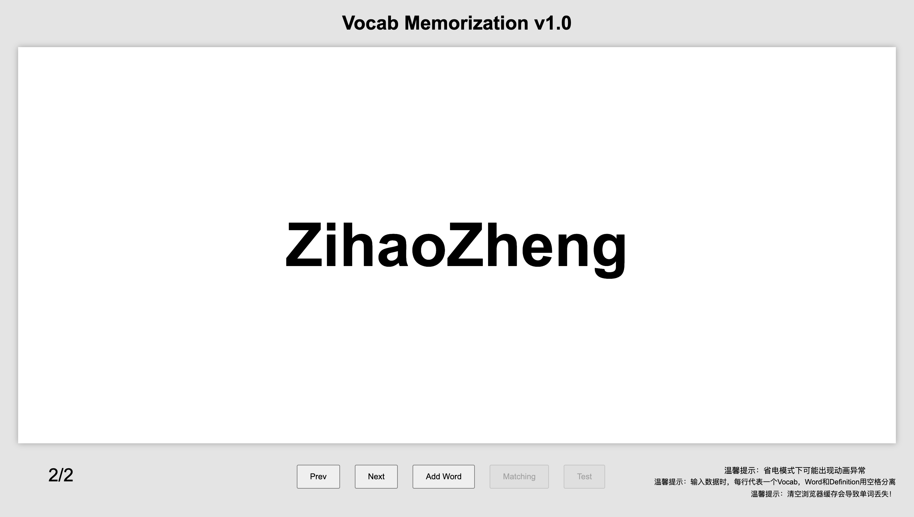

# Quizlet
## This is a 低配 version of Quizlet that helps students study and memorize vocabulary words.

The initial goal was to help Zihao memorize Korean vocabulary, however, it is now free to public

1. Hit right arrow for next vocab
2. Hit space to flip the card.
3. Hit left arrow for prev vocab

Upcomming features:
1. Test
2. Matching
3. Themes (such as syncing with OS)
   
### link <a href="https://zhengzihao2002.github.io/quizlet">Live Demo</a>

